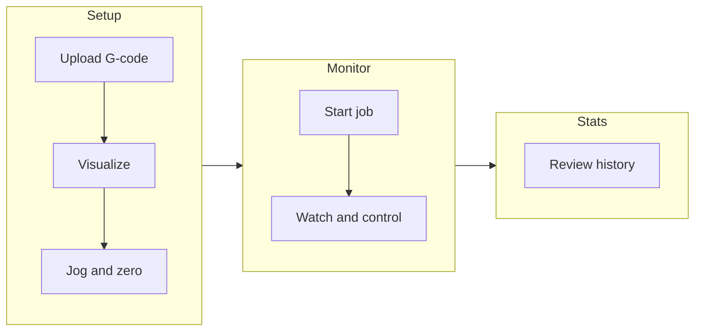

# Workflow Overview

AxioCNC is built around a simple flow: **Setup → Monitor → Stats**. Use each screen for a specific phase of your work.

## The three phases

1. **Setup** — Prepare the job. Upload G-code, check the toolpath, position the workpiece, set work zero. No cutting yet.
2. **Monitor** — Run the job. Start, pause, resume, or stop. Watch position, progress, and console. Handle tool changes if needed.
3. **Stats** — Look back. See past jobs, run times, and tool usage.

## When to use each screen

- **Setup:** Before every run. Loading a new file, changing workpiece, or re-zeroing.
- **Monitor:** While the job is running. You can switch to it automatically when you start from Setup (if enabled in settings).
- **Stats:** After jobs, or when you want to check history and usage.

## Typical path

1. Design in CAM (Fusion 360, Carbide Create, VCarve, etc.) and export G-code.
2. **Setup:** Upload the file, inspect the visualizer, jog to position, set work zero.
3. **Monitor:** Start the job. Use Feed Hold if you need to pause, then Resume. Use Stop only when you intend to abort.
4. **Stats:** Review the run and any previous jobs.

You can use different devices: e.g. design on a PC, run Setup and Monitor from a tablet in the shop, check Stats from anywhere on the network.

## Next steps

- [Setup screen](./setup-screen)
- [Monitor screen](./monitor-screen)
- [Stats screen](./stats-screen)
